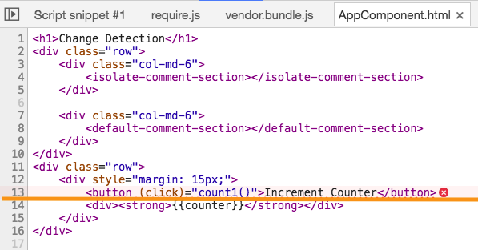
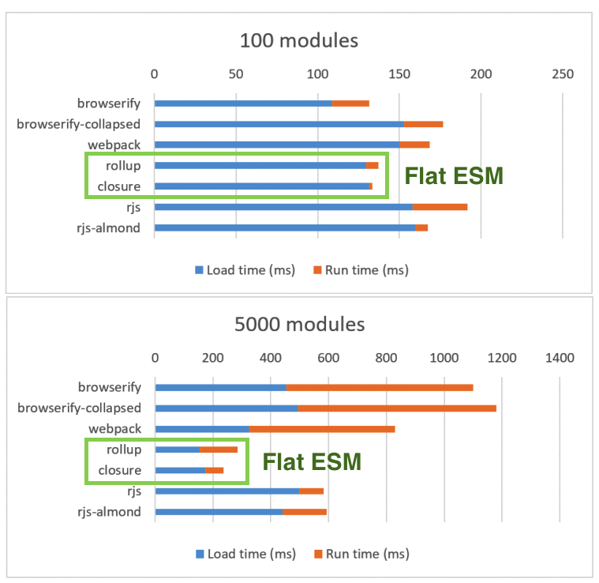
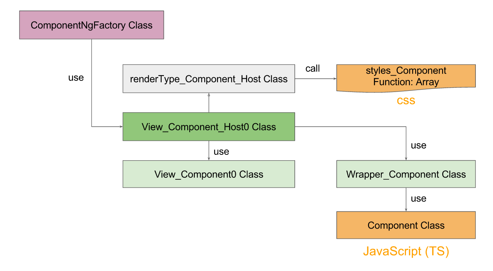
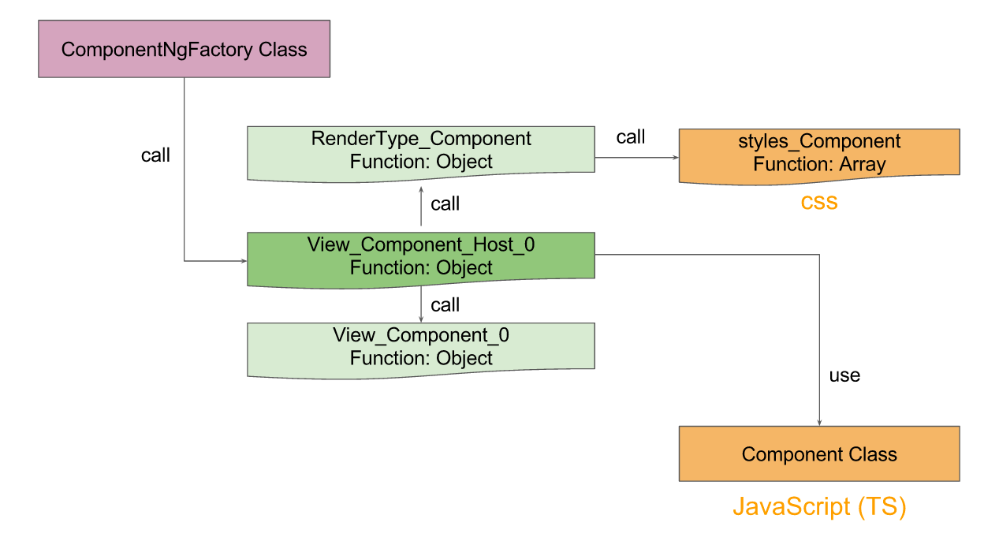

#### 2016. 9. 14. Angular 2.0.0 Release

<div class="fragment">
    <h2>2017. 3. 23. <span class="yellow">Angular 4.0.0</span> Release</h2>
    <p>invisible-makeover "보이지 않는 변신"</p>
</div>

-----

## Angular4는 어떻게 달라졌나요?

-----


<!-- .slide:data-background="#1A3819" -->

## Angular4에서 달라진 점
<small><a href="http://angularjs.blogspot.kr/2017/03/angular-400-now-available.html">http://angularjs.blogspot.kr/2017/03/angular-400-now-available.html</a></small>

- New Feature
- Small & Faster

-----

## New Feature

-----

### 템플릿 문법 추가
- `*ngIf`에서 **else 표현** 가능
- `*ngFor`에서 **로컬 변수** 선언 가능

```js
<div *ngIf="userList | async as users; else loading">
  <user-profile 
    *ngFor="let user of users; count as count; index as i" 
    [user]="user"
  >
    User {{i}} of {{count}}
  </user-profile>
</div>
```

-----

### Angular Universal
https://github.com/angular/universal

- Angular4부터 모듈로 제공
```js
import { 
    platformServer,
    renderModuleFactory
} from '@angular/platform-server';
```
- NodeJS, ASP.NET 예제 제공
- <!-- .element: class="fragment" --> <span class="yellow">Angular 4.1+</span> 부터 **Angular CLI**에서 제공 

-----

### 템플릿에 대한 에러. Source Map 제공


-----


 <!-- .element: class="fragment" --> 

-----


<!-- .slide: data-background="#e7ad52" -->

## Small & Faster

- 구글은 어떻게 용량을 감소하고, 성능 개선을 했나?

-----

### 1. 공통 모듈 코드 최소화
- Animation 패키지 분리

```js
// Angular 2.x
// import { transition, animate } from '@angular/core';
```

```js
// Angular 4.x
import { 
    BrowserAnimationsModule 
} from '@angular/platform-browser/animations';
import { transition, animate } from '@angular/animations';
```

**@angular/core 모듈을 가볍게~** <!-- .element: class="fragment" --> 

-----


<small style="float:right">단위 : byte</small>

|버전|vendor.bundle.js|vendor.bundle.min.js|
|----|----|
|Angular 2.3.1|2,885,955|359,705|
|Angular 4.0.2|2,137,116|320,847|
|개선율|**35.0%**|**12.1%**|

-----

### 2. Package의 변화
__Flat ES Modules__ (Flat ESM/FESM) 로 변경


```js
// module1
const module1 = 10;
export default {module1};
```

```js
// module2
const module2 = 10;
export default {module2};
```

```js
// index.js
import module1 from "./module1";
import module2 from "./module2";

const total = module1 + module2;
```

-----

#### Isolate scope
- functions-within-functions 비용

```
// module1.js
(function(module, export, require) {
    var module1 = 10;
    export["a"] = { module1: module1 };
}),
// module2.js
(function(module, export, require) {
    var module2 = 20;
    export["a"] = { module2: module2 };
}),
// index.js
(function(module, export, require) {
    var __WEBPACK_IMPORTED_MODULE_0__module1__ = require(0);
    var __WEBPACK_IMPORTED_MODULE_1__module2__ = require(1);
    var total = 
        __WEBPACK_IMPORTED_MODULE_0__module1__["a"] 
        + __WEBPACK_IMPORTED_MODULE_1__module2__["a"];
    console.log(total);
})
```

-----

#### Single Scope (Flat ESM/FESM)
- hoisting 비용

```
(function () {
    // module1.js
    var module1 = 10;
    // ...

    // module2.js
    var module2 = 20;
    // ...
    
    // index1.js
    var total = module1 + module2;
});
```

-----

  <!-- .element: style="height:600px" -->

-----

### 3. View engine의 변화

<span class="yellow">AOT</span>가 생성한 코드를 기존 대비 **약 60% 정도** 감소

<small>템플릿이 복잡할 수록 절약하는 효과가 크다.</small>

-----

#### View Engine은?

<iframe src="https://docs.google.com/presentation/d/1g3dhiXSW1XKYxTX0mH_xPozltS8QBpEOMJ49W67T4JE/embed?start=false&loop=false&delayms=3000" frameborder="0" width="100%" height="500px" allowfullscreen="true" mozallowfullscreen="true" webkitallowfullscreen="true"></iframe>

-----

### HTML 변환 과정
```html
<div style="border: 1px solid black;padding: 5px;">
    <div class="alert alert-info">
        {{message}}
    </div>
    <div><strong>{{lastUpdated()}}</strong></div>
</div>
```

-----

### <span class="yellow">Angular 2.x</span>에서는
### 컴포넌트가 만들어지면...

-----

- <span class="yellow">Wrapper_[Component]</span> 생성
 - 컴포넌트 별 LifeCycle, 공통행위에 대한 정의
  (ngOnDestroy, ngDoCheck, handleEvent, ...)

```js
var Wrapper_DefaultCommentComponent = (function () {
    function Wrapper_DefaultCommentComponent() {
        this._changed = false;
        this.context = new __WEBPACK_IMPORTED_MODULE_0__app_comment_default_comment_default_comment_component__["a" /* DefaultCommentComponent */]();
    }
    Wrapper_DefaultCommentComponent.prototype.ngOnDetach = function (view, componentView, el) {
    };
    Wrapper_DefaultCommentComponent.prototype.ngOnDestroy = function () {
    };
    Wrapper_DefaultCommentComponent.prototype.ngDoCheck = function (view, el, throwOnChange) {
        var changed = this._changed;
        this._changed = false;
        if (!throwOnChange) {
            if ((view.numberOfChecks === 0)) {
                this.context.ngOnInit();
            }
        }
        return changed;
    };
    Wrapper_DefaultCommentComponent.prototype.checkHost = function (view, componentView, el, throwOnChange) {
    };
    Wrapper_DefaultCommentComponent.prototype.handleEvent = function (eventName, $event) {
        var result = true;
        return result;
    };
    Wrapper_DefaultCommentComponent.prototype.subscribe = function (view, _eventHandler) {
        this._eventHandler = _eventHandler;
    };
    return Wrapper_DefaultCommentComponent;
}());
```

-----

- <span class="yellow">View_[Component]_Host0, ...</span> 생성
 - 랜더링 작업, changeDetection 처리 로직, ...

```js
var View_DefaultCommentComponent_Host0 = (function (_super) {
    __extends(View_DefaultCommentComponent_Host0, _super);
    function View_DefaultCommentComponent_Host0(viewUtils, parentView, parentIndex, parentElement) {
        _super.call(this, View_DefaultCommentComponent_Host0, renderType_DefaultCommentComponent_Host, __WEBPACK_IMPORTED_MODULE_4__angular_core_src_linker_view_type__["a" /* ViewType */].HOST, viewUtils, parentView, parentIndex, parentElement, __WEBPACK_IMPORTED_MODULE_5__angular_core_src_change_detection_constants__["b" /* ChangeDetectorStatus */].CheckAlways);
    }
    View_DefaultCommentComponent_Host0.prototype.createInternal = function (rootSelector) {
        this._el_0 = __WEBPACK_IMPORTED_MODULE_2__angular_core_src_linker_view_utils__["selectOrCreateRenderHostElement"](this.renderer, 'default-comment-section', __WEBPACK_IMPORTED_MODULE_2__angular_core_src_linker_view_utils__["EMPTY_INLINE_ARRAY"], rootSelector, null);
        this.compView_0 = new View_DefaultCommentComponent0(this.viewUtils, this, 0, this._el_0);
        this._DefaultCommentComponent_0_3 = new Wrapper_DefaultCommentComponent();
        this.compView_0.create(this._DefaultCommentComponent_0_3.context);
        this.init(this._el_0, (this.renderer.directRenderer ? null : [this._el_0]), null);
        return new __WEBPACK_IMPORTED_MODULE_6__angular_core_src_linker_component_factory__["a" /* ComponentRef_ */](0, this, this._el_0, this._DefaultCommentComponent_0_3.context);
    };
    View_DefaultCommentComponent_Host0.prototype.injectorGetInternal = function (token, requestNodeIndex, notFoundResult) {
        if (((token === __WEBPACK_IMPORTED_MODULE_0__app_comment_default_comment_default_comment_component__["a" /* DefaultCommentComponent */]) && (0 === requestNodeIndex))) {
            return this._DefaultCommentComponent_0_3.context;
        }
        return notFoundResult;
    };
    View_DefaultCommentComponent_Host0.prototype.detectChangesInternal = function (throwOnChange) {
        this._DefaultCommentComponent_0_3.ngDoCheck(this, this._el_0, throwOnChange);
        this.compView_0.internalDetectChanges(throwOnChange);
    };
    View_DefaultCommentComponent_Host0.prototype.destroyInternal = function () {
        this.compView_0.destroy();
    };
    View_DefaultCommentComponent_Host0.prototype.visitRootNodesInternal = function (cb, ctx) {
        cb(this._el_0, ctx);
    };
    return View_DefaultCommentComponent_Host0;
}(__WEBPACK_IMPORTED_MODULE_1__angular_core_src_linker_view__["a" /* AppView */]));
```

-----

- <span class="yellow">View_[Component]0, ...</span> 생성
 - 실제 템플릿의 상세 내역 구현

```js
var View_DefaultCommentComponent0 = (function (_super) {
    __extends(View_DefaultCommentComponent0, _super);
    function View_DefaultCommentComponent0(viewUtils, parentView, parentIndex, parentElement) {
        _super.call(this, View_DefaultCommentComponent0, renderType_DefaultCommentComponent, __WEBPACK_IMPORTED_MODULE_4__angular_core_src_linker_view_type__["a" /* ViewType */].COMPONENT, viewUtils, parentView, parentIndex, parentElement, __WEBPACK_IMPORTED_MODULE_5__angular_core_src_change_detection_constants__["b" /* ChangeDetectorStatus */].CheckAlways);
        this._expr_10 = __WEBPACK_IMPORTED_MODULE_8__angular_core_src_change_detection_change_detection_util__["b" /* UNINITIALIZED */];
        this._expr_11 = __WEBPACK_IMPORTED_MODULE_8__angular_core_src_change_detection_change_detection_util__["b" /* UNINITIALIZED */];
    }
    View_DefaultCommentComponent0.prototype.createInternal = function (rootSelector) {
        var parentRenderNode = this.renderer.createViewRoot(this.parentElement);
        this._el_0 = __WEBPACK_IMPORTED_MODULE_2__angular_core_src_linker_view_utils__["createRenderElement"](this.renderer, parentRenderNode, 'div', new __WEBPACK_IMPORTED_MODULE_2__angular_core_src_linker_view_utils__["InlineArray2"](2, 'style', 'border: 1px solid black;padding: 5px;'), null);
        this._text_1 = this.renderer.createText(this._el_0, '\n    ', null);
        this._el_2 = __WEBPACK_IMPORTED_MODULE_2__angular_core_src_linker_view_utils__["createRenderElement"](this.renderer, this._el_0, 'div', new __WEBPACK_IMPORTED_MODULE_2__angular_core_src_linker_view_utils__["InlineArray2"](2, 'class', 'alert alert-info'), null);
        this._text_3 = this.renderer.createText(this._el_2, '', null);
        this._text_4 = this.renderer.createText(this._el_0, '\n    ', null);
        this._el_5 = __WEBPACK_IMPORTED_MODULE_2__angular_core_src_linker_view_utils__["createRenderElement"](this.renderer, this._el_0, 'div', __WEBPACK_IMPORTED_MODULE_2__angular_core_src_linker_view_utils__["EMPTY_INLINE_ARRAY"], null);
        this._el_6 = __WEBPACK_IMPORTED_MODULE_2__angular_core_src_linker_view_utils__["createRenderElement"](this.renderer, this._el_5, 'strong', __WEBPACK_IMPORTED_MODULE_2__angular_core_src_linker_view_utils__["EMPTY_INLINE_ARRAY"], null);
        this._text_7 = this.renderer.createText(this._el_6, '', null);
        this._text_8 = this.renderer.createText(this._el_0, '\n    ', null);
        this._text_9 = this.renderer.createText(this._el_0, '\n', null);
        this.init(null, (this.renderer.directRenderer ? null : [
            this._el_0,
            this._text_1,
            this._el_2,
            this._text_3,
            this._text_4,
            this._el_5,
            this._el_6,
            this._text_7,
            this._text_8,
            this._text_9
        ]), null);
        return null;
    };
    View_DefaultCommentComponent0.prototype.detectChangesInternal = function (throwOnChange) {
        var currVal_10 = __WEBPACK_IMPORTED_MODULE_2__angular_core_src_linker_view_utils__["inlineInterpolate"](1, '\n        ', this.context.message, '\n    ');
        if (__WEBPACK_IMPORTED_MODULE_2__angular_core_src_linker_view_utils__["checkBinding"](throwOnChange, this._expr_10, currVal_10)) {
            this.renderer.setText(this._text_3, currVal_10);
            this._expr_10 = currVal_10;
        }
        var currVal_11 = __WEBPACK_IMPORTED_MODULE_2__angular_core_src_linker_view_utils__["inlineInterpolate"](1, '', this.context.lastUpdated(), '');
        if (__WEBPACK_IMPORTED_MODULE_2__angular_core_src_linker_view_utils__["checkBinding"](throwOnChange, this._expr_11, currVal_11)) {
            this.renderer.setText(this._text_7, currVal_11);
            this._expr_11 = currVal_11;
        }
    };
    return View_DefaultCommentComponent0;
}(__WEBPACK_IMPORTED_MODULE_1__angular_core_src_linker_view__["a" /* AppView */]));
```

-----

#### createInternal 메소드

```
var parentRenderNode = this.renderer.createViewRoot(this.parentElement);
this._el_0 = createRenderElement(
    this.renderer, parentRenderNode, 
    'div', 
    new InlineArray2(
        2, 
        'style', 
        'border: 1px solid black;padding: 5px;'
    ), 
    null);
this._text_1 = this.renderer.createText(this._el_0, '\n    ', null);
this._el_2 = createRenderElement(
    this.renderer, this._el_0, 
    'div', 
    new InlineArray2(
        2, 
        'class', 
        'alert alert-info'
    ), null);
this._text_3 = this.renderer.createText(this._el_2, '', null);
this._text_4 = this.renderer.createText(this._el_0, '\n    ', null);
this._el_5 = createRenderElement(
    this.renderer, this._el_0, 
    'div',
    EMPTY_INLINE_ARRAY, 
    null);
this._el_6 = createRenderElement(
    this.renderer, this._el_5, 
    'strong', EMPTY_INLINE_ARRAY,
    null);
this._text_7 = this.renderer.createText(this._el_6, '', null);
this._text_8 = this.renderer.createText(this._el_0, '\n    ', null);
this._text_9 = this.renderer.createText(this._el_0, '\n', null);
this.init(null, (this.renderer.directRenderer ? null : [
    this._el_0,
    this._text_1,
    this._el_2,
    this._text_3,
    this._text_4,
    this._el_5,
    this._el_6,
    this._text_7,
    this._text_8,
    this._text_9
]), null);
```

<!-- .element: class="fragment" --> **createRenderElement, createText** 동적 노드 생성 

-----

### <span class="yellow">Angular 4.x</span>에서는
### 컴포넌트가 만들어지면...

-----

- <span class="yellow">Wrapper_[Component]</span> 존재하지 않음

-----

- <span class="yellow">View_[Component]_Host_0, ...</span> 생성
 - viewDef의 반환값(Object)를 반환

```js
function View_DefaultCommentComponent_Host_0(l) {
    return viewDef(0, [
        (l()(), elementDef(0, null, null, 1, 'default-comment-section', [], null, null, null, View_DefaultCommentComponent_0, RenderType_DefaultCommentComponent)),
        directiveDef(57344, null, 0, __WEBPACK_IMPORTED_MODULE_2__app_comment_default_comment_default_comment_component__["a" /* DefaultCommentComponent */], [], null, null)
    ], function (ck, v) {
        ck(v, 1, 0);
    }, null);
}
```

-----

- <span class="yellow">View_[Component]_0, ...</span> 생성
 - viewDef의 반환값(Object)를 반환

```js
function View_DefaultCommentComponent_0(l) {
    return viewDef(0, [
        (l()(), elementDef(0, null, null, 9, 'div', [[
                'style',
                'border: 1px solid black;padding: 5px;'
            ]
        ], null, null, null, null, null)),
        (l()(), textDef(null, ['\n    '])),
        (l()(), elementDef(0, null, null, 1, 'div', [[
                'class',
                'alert alert-info'
            ]
        ], null, null, null, null, null)),
        (l()(), textDef(null, [
            '\n        ',
            '\n    '
        ])),
        (l()(), textDef(null, ['\n    '])),
        (l()(), elementDef(0, null, null, 2, 'div', [], null, null, null, null, null)),
        (l()(), elementDef(0, null, null, 1, 'strong', [], null, null, null, null, null)),
        (l()(), textDef(null, [
            '',
            ''
        ])),
        (l()(), textDef(null, ['\n    '])),
        (l()(), textDef(null, ['\n']))
    ], null, function (ck, v) {
        var co = v.component;
        var currVal_0 = co.message;
        ck(v, 3, 0, currVal_0);
        var currVal_1 = co.lastUpdated();
        ck(v, 7, 0, currVal_1);
    });
}
```

-----

### viewDef
- elementDef, textDef, derectiveDef, ...을 포함하는 구조

```js
function viewDef(
    flags: ViewFlags, 
    nodes: NodeDef[], 
    updateDirectives?: ViewUpdateFn,
    updateRenderer?: ViewUpdateFn) {
    return { ... };
}
```
**뷰의 정보를 받아 Object를 반환하는 함수**

-----



**Angular2는 HTML => Class 기반으로 변경**

-----



**Angular4는 HTML => Object 정보기반으로 변경**

-----


<iframe src="https://docs.google.com/presentation/d/1S88Pep6rULc8m-iZgBjafK5X2MAWFAHLmQi81NEIs44/embed?start=false&loop=false&delayms=3000" frameborder="0" width="100%" height="500px" allowfullscreen="true" mozallowfullscreen="true" webkitallowfullscreen="true"></iframe>

-----

<small style="float:right">단위 : byte</small>


|버전|main.bundle.js|main.bundle.min.js|
|----|----|
|Angular 2.3.1|134,302|45,566|
|Angular 4.0.2|90,671|23,131|
|개선율|**48.1%**|**97.0%**|

-----


<!-- .slide:data-background="#1A3819" -->

## Angular4는 어떻게 달라졌나요?

-----

## 사실 사용자 입장에서는 
## 크게 변한게 없다.

[Angular update 가이드](https://angular-update-guide.firebaseapp.com/)

else 문법 추가...
용량 감소. Performance 향상...

-----

## Angular에 지속적인 관심을...
<h3 class="fragment"> 더불어 <span class="yellow">Angular Meetup</span>도... </h3>


