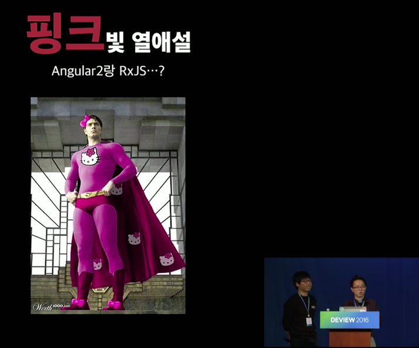

## RxJS 왜 쓰나요?

-----

-----

### 비동기 처리 RxJS말고 다른거 많자너
- Callback
- Promise
- Generator
- Async/Await <!-- .element: class="fragment yellow" --> 

-----

# RxJS가 왜 필요한지 다시 한번 생각해보자.

- Trend Java9 Reactive
난 트랜드에 뒤쳐질수 없어.

- 정말 필요한거야?

-----

<!-- .slide:data-background="#000000" -->
어려운 용어도 많아서 쓰기도 어려운데.

-----

# RxJS가 담당하는 영역

- 비동기 처리 X

- "안정적인 데이터 플로우를 처리하는 라이브러리"

-----

이게 무슨말이냐면?

-----

어플리케이션의 동작 방식 === 상태머신
상태머신은 입력, 로직, 출력

-----

입력은 동기나 비동기로 나와 어떻게 해야겠니?
Observable
[하나의 방식으로 처리하자. - 인터페이스의 단일화]

-----

이 입력은 또 다른 상태머신으로 부터 전달되자너
바로 전달되어야해 (PUSH)
[상태 전파가 문제] - reactive programming

-----

로직은 어떻니?
가장 문제되는게 조건문, 반복문. 흐름을 따라가야해
그리고 로직에서 외부 상태를 변경하는게 문제야.
이게 바로 immutable이 중요한거야.
사이드 이펙트라는 거지
즉, 순수함수를 써라는 거지.

이게 왜 중요하냐면 동시성 작업이 작렬이지.

-----

RxJS에서는 이런거 별생각 안하고도 쓰게 해줌.
공부만 한다면...

-----

알아보자 RxJS

-----

RxJS에서는 다루는 중요 개념은 다음과 같다.

Observable
Operator
Observer
Subscription
Subject
Scheduler

----

하지만 4대 천왕만 알면 된다.
다른거는 심화과정임

----

실제 RxJS는 다음과 같이 정의해.

첫째. 데이터 소스를 Observable로 변경한다.
둘째. Observable의 operator를 통해 데이터를 변경하거나 추출한다.
또는 여러 개의 Observable을 하나의 Observable로 합치거나 하나의 Observable을 여러 개의 Observable로 만든다.
셋째. 원하는 데이터를 받아 처리하는 Observer를 만든다.
넷째. Observable의 subscribe를 통해 Observer를 등록한다.
다섯째. Observable 구독을 정지하고 자원을 해지한다.

-----

다시 질문드립니다.
RxJS 써야겠어요? 안써야겠어요?

-----

코딩 잘하면 안써도 되요
철학을 이해하고 쓰면 많은 것을 도와줍니다.

-----

여기에서 이야기한 자세한 설명은 다음 사이트에서 보실수 있습니다.

github.com/sculove/rxjs-book
sculove.github.com

-----

