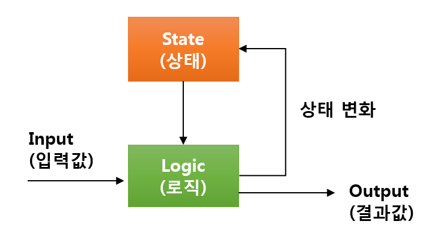
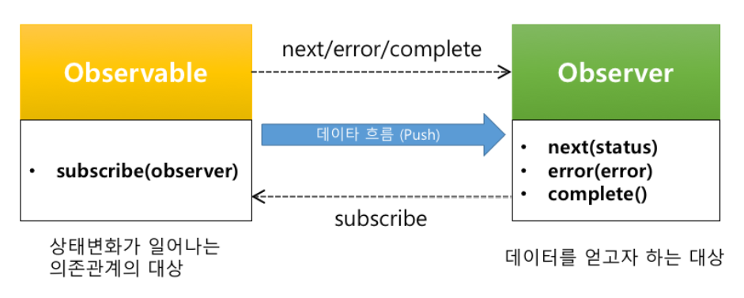
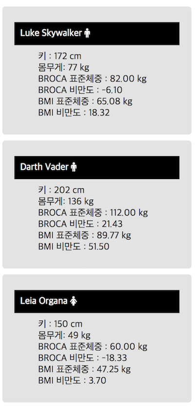
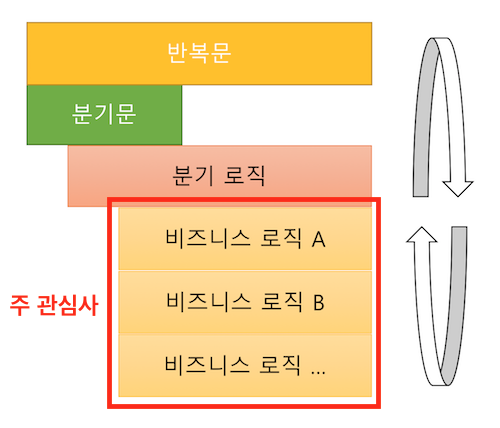
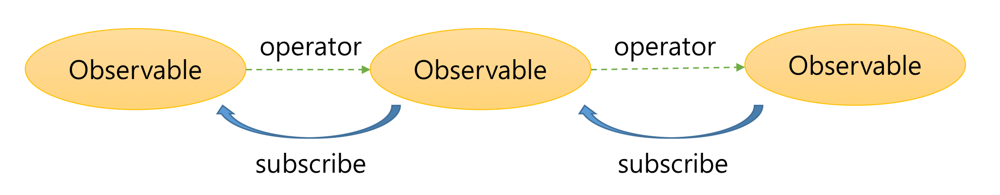

## RxJS 왜 쓰나요?


-----


-----

### 비동기 처리. RxJS말고 다른거 많자너
- Callback  <!-- .element: class="fragment" --> 
- Promise <!-- .element: class="fragment" --> 
- Generator <!-- .element: class="fragment" --> 
- Async/Await <!-- .element: class="fragment yellow" --> 

<br>
<h2 class="fragment">심지어 <strong>표준</strong>인데</h2>
<h4 class="fragment">물론. RxJS도 <strong class="grey">표준...</strong><span class="fragment">에 제안 중</span></h4>

-----

<!-- .slide: data-background="#000000" -->
어려운 용어도 많아서 쓰기도 어려운데.


-----

# 왜? RxJS를 써야하나?

-----

## Reactive


<br>


-----

## Functional


-----


<div><strong class="bigsize">본질</strong>은 그게 아니다.</div>

-----

### RxJS가 담당하는 영역

## 비동기 처리 <!-- .element: class="yellow" -->
## 데이터 전파 <!-- .element: class="fragment yellow" -->
## 데이터 처리 <!-- .element: class="fragment yellow" -->


-----

# RxJS는 
<h2 class="fragment"><strong class="yellow">일관된 방식</strong>으로</h1>
<h2 class="fragment"><strong class="green">안전</strong>하게</h1>
<h2 class="fragment"><strong>데이터 흐름</strong>을</h1>
<h2 class="fragment"><strong class="blue">처리</strong>하는</h1>
## 라이브러리 이다.

-----

## 이게 무슨말이냐면?


-----

#### 모든 어플리케이션은 
## 궁극적으로 __상태머신__이다.




-----

#### 개발자가 처리하는 
## <strong>입력값(Input)</strong>은 어떤 것들이 있는가?  
<br>
<h5 class="fragment"><strong class="green bigsize">배열 데이터</strong>도 입력값으로</h5>
<h5 class="fragment"><strong class="green bigsize">함수 반환값 </strong>도 입력값으로</h5>
<h5 class="fragment"><strong class="yellow bigsize">키보드를 누르는 것</strong>도 입력값으로</h5>
<h5 class="fragment"><strong class="yellow bigsize">마우스를 움직이는 것</strong>도 입력값으로</h5>
<h5 class="fragment"><strong class="blue bigsize">원격지의 데이터</strong>도 입력값으로</h5>
<h5 class="fragment"><strong class="blue bigsize">DB 데이터</strong>도 입력값으로</h5>
<h4 class="fragment">...</h4>

-----

## 개발자의 고민 중 하나

어떤 것은 <strong class="yellow">동기 (Synchronous)</strong>  
어떤 것은 <strong>비동기 (Asynchronous)</strong>

<p class="fragment">
어떤 것은 <strong class="yellow">함수 호출(Call)</strong>  
어떤 것은 <strong >이벤트(Event)</strong>  
어떤 것은 <strong class="grey">Callback</strong>  
어떤 것은 <strong class="green">Promise</strong>
</p>

<h3 class="fragment blue">각각에 따라 처리해야한다.</h3>

-----

<div class="data-container">
  <div style="float:left; margin-right:100px">배열 데이터를 처리하는 경우</div>
  <div class="data back-yellow fragment">arr[0]</div>
  <div class="data back-yellow fragment">arr[1]</div>
  <div class="data back-yellow fragment">arr[2]</div>
</div>
<br>
<div class="data-container">
  <div style="float:left; margin-right:100px">함수를 호출한 경우</div>
  <div class="data back-grey fragment">call</div>
  <div class="data back-grey fragment">call</div>
  <div class="data back-grey fragment">call</div>
</div>
<br>
<div class="data-container">
  <div style="float:left; margin-right:100px">마우스를 클릭하는 경우</div>
  <div class="data fragment" style="margin-right:50px">click</div>
  <div class="data fragment" style="margin-right:100px">click</div>
  <div class="data fragment">click</div>
</div>
<br>
<div class="data-container">
  <div style="float:left; margin-right:100px">Ajax를 호출한 경우</div>
  <div class="data back-blue fragment" style="width:150px;margin-right:100px">request</div>
  <div class="data back-blue fragment" style="width:150px">response</div>
</div>

-----


<div class="data-container">
  <div style="float:left; margin-right:100px">배열 데이터를 처리하는 경우</div>
  
  <div class="yellow" style="float:left">[</div>
  <div class="data back-yellow">arr[0]</div>
  <div class="yellow" style="float:left">,</div>
  <div class="data back-yellow">arr[1]</div>
  <div class="yellow" style="float:left">,</div>
  <div class="data back-yellow">arr[2]</div>
  <div class="yellow" style="float:left">]</div>
</div>
<br>
<div class="data-container">
  <div style="float:left; margin-right:100px">함수를 호출한 경우</div>
  <div class="grey" style="float:left">[</div>
  <div class="data back-grey ">call</div>
  <div class="grey" style="float:left">,</div>
  <div class="data back-grey ">call</div>
  <div class="grey" style="float:left">,</div>
  <div class="data back-grey ">call</div>
  <div class="grey" style="float:left">]</div>
</div>
<br>
<div class="data-container">
  <div style="float:left; margin-right:100px">마우스를 클릭하는 경우</div>
  <div style="color:red; float:left">[</div>
  <div class="data " style="margin-right:50px">click</div>
  <div style="color:red; float:left">,</div>
  <div class="data " style="margin-right:100px">click</div>
  <div style="color:red; float:left">,</div>
  <div class="data ">click</div>
  <div style="color:red; float:left">]</div>
</div>
<br>
<div class="data-container">
  <div style="float:left; margin-right:100px">Ajax를 호출한 경우</div>
  <div class="blue" style="float:left">[</div>
  <div class="data back-blue " style="width:150px;margin-right:100px">request</div>
  <div class="blue" style="float:left">,</div>
  <div class="data back-blue " style="width:150px">response</div>
  <div class="blue" style="float:left">]</div>
</div>
<br><br>
<div>
  <div class="arrow"></div>
  <strong class="bigsize">TIME</strong>
</div>
<br>
<h3 class="fragment"> 시간축 관점에서 결국 <strong class="bigsize yellow">동기 === 비동기</strong></h3>


-----


## 하나의 방식으로 처리하자. 
## <strong class="yellow">인터페이스의 단일화</strong>

-----

## Observable

시간을 인덱스로 둔 컬렉션

<div class="data-container">
  <div style="color:blue; float:left">[&nbsp;</div>
  <div class="data back-blue " style="margin-right:10px">data</div>
  <div style="color:blue; float:left">,</div>
  <div class="data back-blue " style="margin-right:10px">data</div>
  <div style="color:blue; float:left">,</div>
  <div class="data back-blue " style="margin-right:10px">data</div>
  <div style="color:blue; float:left">,</div>
  <div class="data back-blue " style="margin-right:10px">data</div>
  <div style="color:blue; float:left">,</div>
  <div class="data back-blue  " style="margin-right:10px">data</div>
  <div style="color:blue; float:left">,</div>
  <div class="data back-blue  " style="margin-right:10px">data</div>
  <div style="color:blue; float:left">,</div>
  <div class="data back-blue ">data</div>
  <div style="color:blue; float:left">&nbsp;]</div>
</div>
<br><br>
<div>
  <div class="arrow"></div>
  <strong class="bigsize">TIME</strong>
</div>

-----

## 개발자의 고민 중 하나

<p style="text-decoration:line-through">
어떤 것은 <strong class="yellow">동기 (Synchronous)</strong>  
어떤 것은 <strong>비동기 (Asynchronous)</strong>  
어떤 것은 <strong class="yellow">함수 호출(Call)</strong>  
어떤 것은 <strong >이벤트(Event)</strong>  
어떤 것은 <strong class="grey">Callback</strong>  
어떤 것은 <strong class="green">Promise</strong>
</p>

<h3 class="fragment blue">모두 Observable로 처리한다</h3>

-----


#### 모든 어플리케이션은 
<h2 class="fragment red">궁극적으로 __상태머신__이다.</h2>
<div class="fragment">
<h2>궁극적으로 __상태머신의 집합__이다.</h2>


</div>

-----


## 개발자의 고민 중 하나
<strong class="yellow bigsize">의존관계가 있는 상태머신</strong>에게  
변경된 상태 정보를 <strong class="bigsize">어떻게 전달하지?</strong>

-----

## Reactive Programming

데이터 흐름과 상태 변화 전파에 중점을 둔 프로그램 패러다임이다.  사용되는 프로그래밍 언어에서 데이터 흐름을 쉽게 표현할 수 있어야하며 기본 실행 모델이 변경 사항을 <strong class="yellow bigsize">데이터 흐름</strong>을 통해 <strong class="bigsize">자동으로 전파한다</strong>는 것을 의미한다.

<small>출처 : <a href="https://en.wikipedia.org/wiki/Reactive_programming">https://en.wikipedia.org/wiki/Reactive_programming</a></small>

-----

## 이미 우리는 알고 있었다.
Observer pattern


-----

## Observer Pattern


Subject의 <strong class="blue">변경사항</strong>이 생기면 <strong>자동</strong>으로  
<strong  class="yellow">Observer의 update를 호출한다.</strong> <strong class="yellow">(Loosely Coupling)</strong>

-----


## Observer Pattern을 적용하자
### <strong class="yellow">상태 자동전파</strong>
### <strong class="yellow">Loosely Coupling</strong>


-----

## 개선된 Observer Pattern 



<strong class="blue">next, error, complete</strong>의 3가지 상태를 전달받음

-----

## 데이터를 받은 후에는 뭐하니?
데이터를 받은 후에 받은 데이터를 가공한다.

-----



-----

#### 1. Ajax로 데이터를 받음.

<pre><code data-trim data-noescape>
const xhr = new XMLHttpRequest();
xhr.onreadystatechange = function() {
    if(xhr.readyState == 4 && xhr.status == 200) {
	const jsonData = JSON.parse(xhr.responseText);
        document.getElementById("users").innerHTML = 
          <mark>process(jsonData);</mark>
    }
};
xhr.open("GET", "https://swapi.co/api/people/?format=json");
xhr.send();
</code></pre>

-----

#### 2. 데이터를 가공함
process 함수

```
// 데이터를 처리하는 함수
function process(people) {
    const html = [];
    for (const user of people.results) {
        if (/male|female/.test(user.gender)) {
	    let broca;
	    let bmi;
            if (user.gender == "male") {
		broca = (user.height - 100 * 0.9).toFixed(2);
		bmi = (user.height / 100 * user.height / 100 * 22).toFixed(2);
	    } else {
		broca = (user.height - 100 * 0.9).toFixed(2);
		bmi = (user.height / 100 * user.height / 100 * 21).toFixed(2);
	    }
	    const obesityUsingBroca = ((user.mass - broca) / broca * 100).toFixed(2);
	    const obesityUsingBmi = ((user.mass - bmi) / bmi * 100).toFixed(2);
			
	    html.push(`<li class='card'>
			  <dl>
			      <dt>${user.name} <i class="fa fa-${user.gender}"></i></dt>
			      <dd><span>키 : </span><span>${user.height} cm</span></dd>
			      <dd><span>몸무게: </span><span>${user.mass} kg</span></dd>
			      <dd><span>BROCA 표준체중 : </span><span>${broca} kg</span></dd>
			      <dd><span>BROCA 비만도 : ${obesityUsingBroca}</span></dd>
			      <dd><span>BMI 표준체중 : </span><span>${bmi} kg</span></dd>
			      <dd><span>BMI 비만도 : ${obesityUsingBmi}</span></dd>
			  </dl>
		      </li>`);
        }
    }
    return html.join("");
}
```

-----

## 개발자의 고민 중 하나

조건문, 반복문 덩어리로 구성됨

```js
if (A) {
  // 이럴 경우에는..
  for(let i = 0; i <len; i++) {
    // 실제 로직A는 여기서...
  }
} else {
  // 저럴 경우에는
  for(let i = 0; i <len; i++) {
    // 실제 로직B는 여기서...
    // 여기도 if문이...
    if (B) {
      // ...
    }
  }
  // ...
}
```

-----

<strong class="yellow bigsize">조건문</strong>은 <strong>코드의 흐름</strong>을 분리하고  
<strong class="yellow bigsize">반복문</strong>은 <strong>코드의 가독성</strong>을 떨어뜨림.



주관심사인 비즈니스 로직은 코드에 파묻힘

-----


### <strong>고차함수</strong>를 제공한다.

-----

filter, map, reduce, ... 와 같은 고차함수의 operator를 제공

```js
Rx.Observable
  .ajax("https://swapi.co/api/people/?format=json")
	.filter(user => /male|female/.test(user.gender))
	.map(user => Object.assign(
			user,
			logic(user.height, user.mass, user.gender)
	))
	.reduce((acc, user) => {
			acc.push(makeHtml(user));
			return acc;
	}, [])
	.subscribe(v => {
			document.getElementById("users").innerHTML = v;
  });
```

-----

## 개발자의 고민 중 하나

내가 실행한 로직이 <strong class="yellow bigsize">나의 의도와 상관없게</strong>  
외부에 <strong>영향을 미친다면?</strong>

<p class="blue">Side Effect</p>

-----


## Side effect

> 함수에 드러나지 않은 입력값을 <strong class="yellow">부원인(Side Cause)</strong>라고 하고 이로 인해 발생한 결과를 <strong>부작용(Side Effect)</strong>

<pre><code data-trim data-noescape>
function getCurrentValue(value) {
    return processAt(value, <mark>new Date()</mark>);
}
</code></pre>

<pre><code data-trim data-noescape>
function get(objectValue) {
    <mark>objectValue.newProp = "바꿨지롱 모르겠지?";</mark>
    // bla bla
    return objectValue;
}
</code></pre>

-----

모든 입력값을 명시적으로 나타낸다.

```js 
function getCurrentValue(value, time) {
    return processAt(value, time);
}
```

Immutable 데이터를 사용한다.
```js 
function get(objectValue) {
    const obj = Object.assign({}, objectValue);
    obj.newProp = "바꿨으면 Immutable 데이터로 바꾸라";
    return obj;
}
```


-----


## Funtional Programming

함수형 프로그래밍은 자료 처리를 수학적 함수의 계산으로 취급하고 <strong class="yellow bigsize">상태 변경과 가변 데이터를 피하려는</strong> 프로그래밍 패러다임의 하나이다.

<small>출처 : <a href="https://en.wikipedia.org/wiki/Functional_programming">https://en.wikipedia.org/wiki/Functional_programming</a></small>

-----

Functional Programming은 
<strong class="bigsize">순수함수</strong>를 지향한다.
 - 같은 입력이 주어지면, 항상 같은 출력을 반환한다.
 - 부작용(side-effect)을 발생시키지 않는다.
 - 외부의 Mutable한 데이터에 의존하지 않는다.

-----


### 함수형 프로그래밍의 <strong>순수함수</strong>를 지향 한다.

-----

Observable 자체가 Immutable.



-----

알아보자 RxJS

-----

RxJS에서는 다루는 중요 개념은 다음과 같다.

Observable
Operator
Observer
Subscription
Subject
Scheduler

-----

하지만 4대 천왕만 알면 된다.
다른거는 심화과정임

-----

실제 RxJS는 다음과 같이 정의해.

첫째. 데이터 소스를 Observable로 변경한다.
둘째. Observable의 operator를 통해 데이터를 변경하거나 추출한다.
또는 여러 개의 Observable을 하나의 Observable로 합치거나 하나의 Observable을 여러 개의 Observable로 만든다.
셋째. 원하는 데이터를 받아 처리하는 Observer를 만든다.
넷째. Observable의 subscribe를 통해 Observer를 등록한다.
다섯째. Observable 구독을 정지하고 자원을 해지한다.

-----

다시 질문드립니다.
RxJS 써야겠어요? 안써야겠어요?

-----

코딩 잘하면 안써도 되요 

하지만, 철학을 이해하고 쓰면 많은 것을 도와줍니다.

-----

여기에서 이야기한 자세한 설명은 다음 사이트에서 보실수 있습니다.


github.com/sculove/rxjs-book
sculove.github.com

-----


