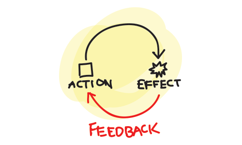

### Test는 필요한가?

-----

### Test는 <strong>정말</strong> 필요한가?

-----

<!-- .slide: data-background="#8c4738" -->
## 왜 테스트가 필요할까요?

-----

### 사례 A
<em>경력 10년차 프로젝트 구성원</em>이 코드를 수정했다.

이를 믿을 수 있나?

-----

### 사례 B
<strong>새롭게</strong> 투입된 <strong>경력 10년차</strong> 개발자가 코드를 수정했다.

이를 믿을 수 있나?

-----

### <em>사람</em> 프로세스를 통해 검증
QA나 개발자가 직접적으로 변경 부분에 대해 side-effect를 실제 테스트하여 확인한다.

-----

### 리소스가 많이 든다.

### <!-- .element: class="fragment" --> <strong>QA 담당자의 역량</strong>에 의해<br>테스트 검증 여부가 결정된다.

-----

<em>새로운 경력 1년차</em> 개발자가 코드를 수정했다.

<em>신입 프로젝트 구성원</em>이 코드를 수정했다.

### 이를 믿을수 있나? <!-- .element: class="fragment" -->

-----

## 테스트 코드만 있다면
## <!-- .element: class="fragment" --> <strong>믿을수 있습니다.</strong>

-----

테스트 코드는
## 빠른 피드백을 준다.


-----


<p>개발(action) -> 테스트 (effect)-> <br>
<strong>피드백</strong> -> 개발 -> 테스트 -> <strong>피드백 </strong>...</p>

-----

또한, 테스트 코드는
## 미래를 위한 안전핀을 제공한다.
<ul>
    <li class="fragment"><em>코드 변경</em>도 겁나지 않아요.</li>
    <li class="fragment"><em>회기 테스트</em>도 순식간에 할수 있어요.</li>
</ul>

-----

이런 장점이 있음에도
# 왜?
## 우리는 테스트 코드를 만들어 내지 못하고 있는가?

-----

# 문제는 단연코 <strong>시간!</strong>

서비스 일정은 정해졌지만, 스펙은 계속 늘어나고,<br>
늘어나기만 하면 괜찮지만, 다 바꾸기까지하죠.

-----

## 테스트 코드는 산출물이 아닌<br> <strong>하나의 서비스</strong>이다.
## <em class="fragment">인식. 프로세스의 변화가 필요</em>

-----

### 관리가자 보는 "개발 끝!의 의미"
<!--  -->

설계 + 구현 <strong class="fragment">+ 테스트 코드 작성</strong>

-----

### 개발자가 보는 "테스트 코드의 시각"
<strong class="yellow">소스와 같이 소중히...</strong>
<ul>
    <li class="fragment">유지보수를 위해 읽기가 쉬워야한다.</li>
    <li class="fragment">리팩토링이 필요하다.</li>
    <li class="fragment">형상관리...</li>
</ul>

-----

### 품질관리가 보는 시각
품질 관리의 시작은 QA 시작부터가 아닌, <br>
<p class="fragment"><strong>테스트 코드</strong> 부터...</p>

-----

# 이러한 마음의 자세가 되었다면...
좀 더 자세히 이야기해보자.

-----

## 테스트를 위한 개발 프로세스

-----

### 개발 프로세스
애자일 방법론에서 사용하는 X-Driven Development 방식

- TDD(Test-Driven Development)
- BDD(Behavior-Driven Development)

<small><em>둘 다 차이가 없음. 단, BDD는 비즈니스 요구사항 중심적. (좀더 자연어에 걸맞게)</em><small>

-----

### TDD와 BDD 프로세스

<p>테스트 First. 실패 First</p>
<p class="fragment"><strong class="red">Red</strong> - <strong class="green">Green</strong> - <strong class="grey">Refactor</strong>의 반복</p>

-----

## 테스트 코드 작성해보기

-----

### 좋은 테스트 코드
<ul>
    <li class="fragment">하나의 테스트는 <em>한가지 기능에 충실</em></li>
    <li class="fragment">A 테스트는 B 테스트에 <em>영향을 미치면 안된다.</em></li>
    <li class="fragment">테스트 전과 후의 상태가 변경되면 안된다.</li>
    <li class="fragment">테스트는 여러번 수행해도 <em>같은 결과를 출력</em>해야한다.</li>
</ul>
<h4 class="fragment"><strong>Funtional Programming ?</strong></h4>

-----

### 테스트 코드 작성 방법
<ol>
    <li class="fragment">사용자 요구사항 관점에서 명세를 만든다</li>
    <li class="fragment"><strong>Given/When/Then 패턴</strong>으로 테스트 시나리오를 작성</li>
    <li class="fragment">코드로 옮김</li>
</ol>

-----

### 1. 명세를 만든다
사용자 관점의 명세를 만든다.

> 숫자가 3으로 나누어지면 결과값은 <em>"Fizz"</em><br>
숫자가 5로 나누어지면 결과값은 <em>"Buzz"</em><br>
숫자가 3과 5로 나누어지면 결과값은 <em>"FizzBuzz"</em>

-----

### 2. Given/When/Then pattern으로
### 시나리오 작성

http://martinfowler.com/bliki/GivenWhenThen.html

- Given : 테스트 전의 상태
- When : 테스트 행위
- Then : 테스트 결과 검증

-----

### 3. 코드로 옮김

테스트 프레임워크 : <span class="fragment highlight-red">jasmine</span>, qunit, mocha

<small><em>mocha는 별도의 assertion 모듈(chai, should, expect)이 필요함</em></small>

^^^^^

### Jasmine Test Framework
<small><a href="http://jasmine.github.io/">jasmine document</a></small>

<pre><code>describe("the name of test suite", function() {
  beforeAll(function() {}); // suite 전에 호출
  afterAll(function() {});	// suite 후에 호출
  beforeEach(function() {})	// 각각의 spec 전에 호출
  afterEach(function() {})	// 각각의 spec 후에 호출
  it("should/contains ... spec1 ", function() {
  	// except(value).matchers
  	except(true).toBe(true);
  	except(true).not.toBe(false);
  });
  it("should/contains ... spec2 ", function() {
	except(true).toEqual(true);
  })
  // ...
});</code></pre>

^^^^^

### <strong class="red">RED</strong> 테스트 코드를 만든다.
Given/When/Then 패턴으로 작성한다.

<pre><code>
describe("FizzBuzz", function() {
  it("should return 'Fizz' when the number is divisible by 3", function() {
      // Given
      // When
      // Then
  });
})
</code></pre>

^^^^^

테스트 코드를 작성한다.
<pre><code>
describe("FizzBuzz", function() {
  it("should return 'Fizz' when the number is divisible by 3", function() {
      // Given
      var fizzBuzz = new FizzBuzz();

      // When
      var result = fizzBuzz.call(3);

      // Then
      expect(result).toEqual("Fizz");
  });
})
</code></pre>

^^^^^

테스트가 실패 했다.


^^^^^

### <strong class="green">Green</strong> 테스트를 통과하게 한다.
코드를 수정한다.

<pre><code>
function FizzBuzz() {}

FizzBuzz.prototype.call = function(num) {
    return "Fizz";
}
</code></pre>

^^^^^

테스트가 성공 했다.


^^^^^

### <strong class="grey">Refactor</strong> 코드를 개선한다.

<pre><code>
function FizzBuzz() {}

FizzBuzz.prototype.call = function(num) {
    if (num % 3 === 0) {
        return "Fizz";
    }
}
</code></pre>

^^^^^

## <a href="../../demo/testing/Runner.html">Demo</a>

-----

## 단위테스트는 쉽다?

-----

### 테스트시 제어하기 힘든 상황이 존재
coupled module
async

-----

### Jasmine test

-----

### Mocking
 - method check : createSpy, createSpyObj
 - method mocking
 -
....
<strong class="fragment">제어가 불가능한 요소는 종속성을 제거</strong>

-----

### 자주 사용하는 테스트 유형
- 비동기 테스트
- setTimeout 테스트
- DOM 테스트 (jasmine-dom)
- Ajax 테스트 (jasmine-ajax)

-----

### 비동기 테스트
- 첫번째 파라미터로 done 함수가 전달됨
```js
it("should support async", function(done) {
    // ...
});
```
- 비동기 작업이 완료되었을 경우, done을 호출
```js
done();
```

^^^^^

<pre><code>describe("Asynchronous specs", function() {
  var value;
  it("should support async execution", function(<mark>done</mark>) {
    // Given
    value = 100;
    expect(value).toEqual(100);
    // Then
    setTimeout(function() {
      expect(value).toEqual(101);
      <mark>done();</mark>
    },100); // 100ms 대기
    // When
    value++;
  });
});</code></pre>

-----

### setTimeout 테스트
- timer mocking
```js
jasmine.clock().install();
jasmine.clock().uninstall();
```
- createSpy로 감시할 함수 생성.
```js
timerCallback = jasmine.createSpy();
```
- jasmine.clock().tick 메소드로 timer 이동
```
jasmine.clock().tick(time);
```

^^^^^

<pre><code>describe("Manually ticking the Jasmine Clock", function() {
  var timerCallback;
  beforeEach(function() {
    <mark>timerCallback = jasmine.createSpy()</mark>;
    <mark>jasmine.clock().install();</mark>  // timer mocking start
  });
  afterEach(function() {
    <mark>jasmine.clock().uninstall();</mark>  // timer mocking end
  });

  it("causes a timeout to be called synchronously", function() {
    // Given
    setTimeout(function() {
      timerCallback();
    }, 100);
    expect(timerCallback).not.toHaveBeenCalled();
    // When
    <mark>jasmine.clock().tick(101);</mark>
    // Then
    expect(timerCallback).toHaveBeenCalled();
  });

  it("causes an interval to be called synchronously", function() {
    // Given
    setInterval(function() {
      timerCallback();
    }, 100);
    expect(timerCallback).not.toHaveBeenCalled();

    // When
    <mark>jasmine.clock().tick(101);</mark>  // 101
    // Then
    expect(timerCallback.calls.count()).toEqual(1);

    // When
    <mark>jasmine.clock().tick(50);</mark>   // 151
    // Then
    expect(timerCallback.calls.count()).toEqual(1);

    // When
    <mark>jasmine.clock().tick(50);</mark>   // 201

    // Then
    expect(timerCallback.calls.count()).toEqual(2);
  });
});</code></pre>

-----

### DOM 테스트
<small><a href="https://github.com/velesin/jasmine-jquery">jasmine-jquery</a></small>

^^^^^

^^^^^

-----

### Ajax 테스트
<small><a href="https://github.com/jasmine/jasmine-ajax">jasmine-ajax</a></small>

^^^^^

^^^^^

-----

1. 환경의 제어
  - 모듈과 주입기법
function(global) {

})(window);

-----

Front-End 테스트 환경 적용해보기

-----

- 테스트 러너 : karma
- 커버리지 : istanbul

-----

## 시나리오 테스트

- E2E 테스트 () === 종단간 테스트 === UI테스트
selunium (http://www.seleniumhq.org/) Web Browser Automation
  - angular용 protractor
  - nightwatch.js
phantomjs [headless webkit]
  - casperjs

-----

<!-- .slide: data-background="#8c4738" -->
## 테스트에 대한 흔한 질문

-----

## Q1. 모든 상황에서 <br>테스트 코드를 작성해야하는가?

-----

테스트 코드가 많아진다.
<p class="fragment">= 소스의 코드가 많아진다.</p>
<p class="fragment">= 변경시 비용이 많이 든다.</p>

<h3 class="fragment"><strong>선별해서 작성하는게 현실적으로 좋다</strong></h3>

-----

### <em>주요 로직</em>의 테스트 코드
결산 로직, 공통 라이브러리...

-----

### <em>버그가 발생한 상황</em>에 대한 테스트 코드
회기 테스트를 위한 테스트 코드 작성

-----

### 전체 큰틀이 변경되지 않는 코드

- <!-- .element: class="fragment" --><strong class="yellow">솔루션 or 라이브러리</strong>
- <!-- .element: class="fragment" --> 자주 변경되는 부분의 테스트를 만들게 되면 <strong>오히려 독이 될 수 있다.</strong>

-----

## Q2. 우리의 목표는 테스트 커버리지

-----


### 테스트 커버리지가 <strong>100%</strong> 이다.
신뢰 할 수 있는가?

-----

### 테스트 커버리지는 그냥 <strong class="bigsize">숫자</strong>일뿐.

-----

#### 테스트 커버리지 보다,

<p class="fragment"><strong class="green">X-Driven 방식의 개발 프로세스</strong>가 잘되고 있는지</p>
<p class="fragment"><strong class="yellow">회기 테스트</strong>가 잘되고 있는지<br> 가 더 중요하다.</p>


-----

## 정리

<ul>
	<li class="fragment">왜 테스트가 필요할까요?
		<blockquote>테스트 코드는 <strong>하나의 서비스</strong>다</blockquote>
	</li>
	<li class="fragment">테스트를 위한 개발 프로세스 (TDD,BDD)<br>
		<strong class="red">Red</strong> - <strong class="green">Green</strong> - <strong class="grey">Refactor</strong>
	</li>
	<li class="fragment">테스트 코드 작성 <strong class="yellow">Given-When-Then</strong></li>
	<li class="fragment">자주 사용하는 테스트 유형</li>
	<li class="fragment">Front-End 테스트 환경</li>
</ul>
